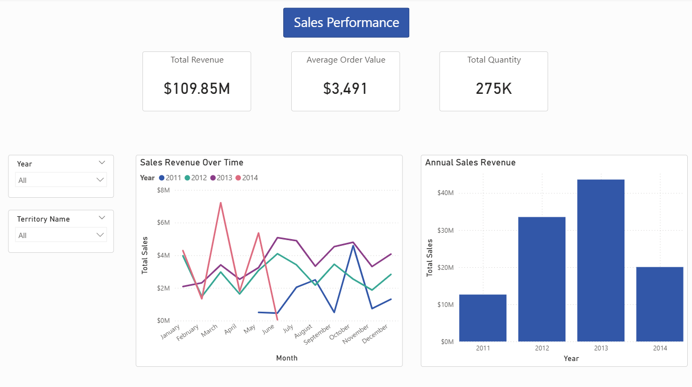
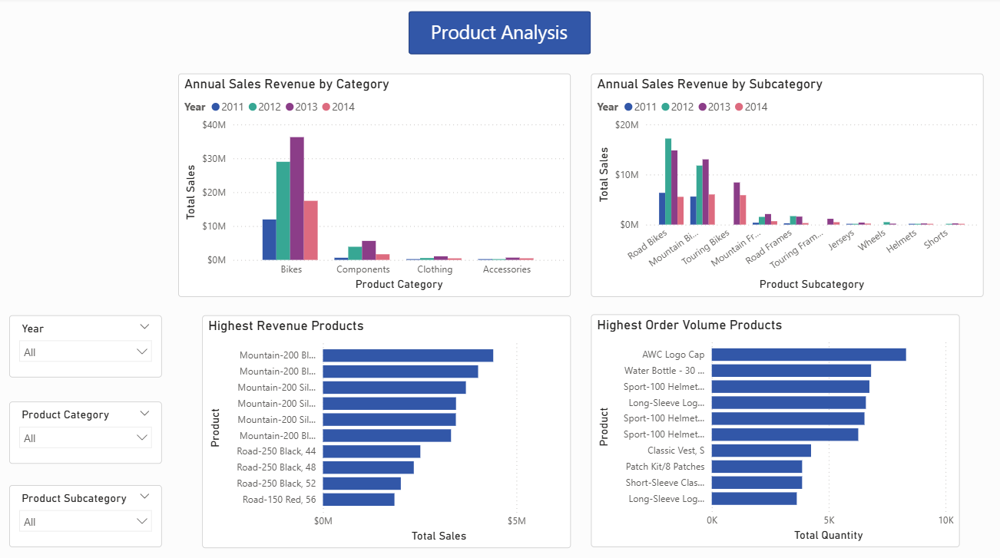
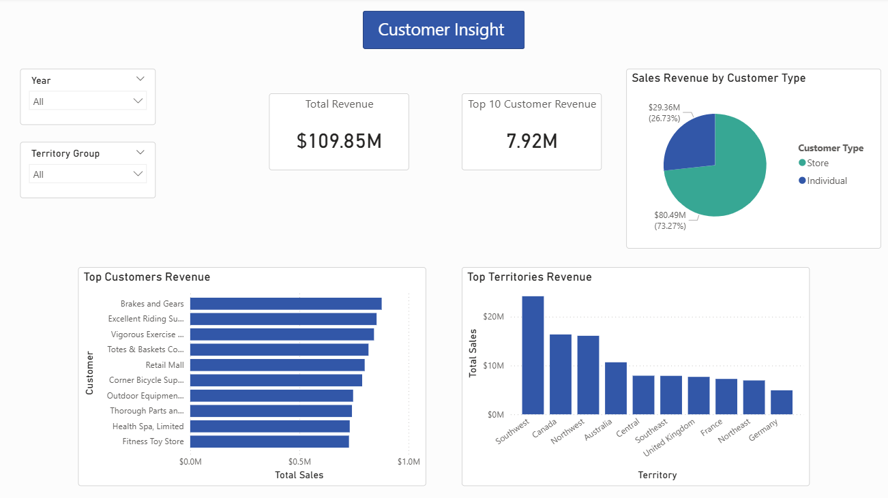
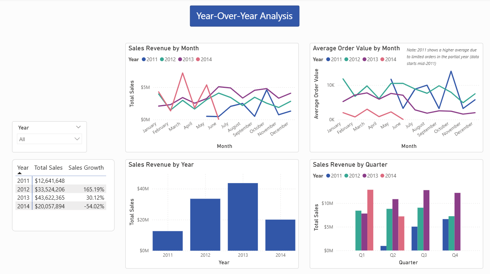
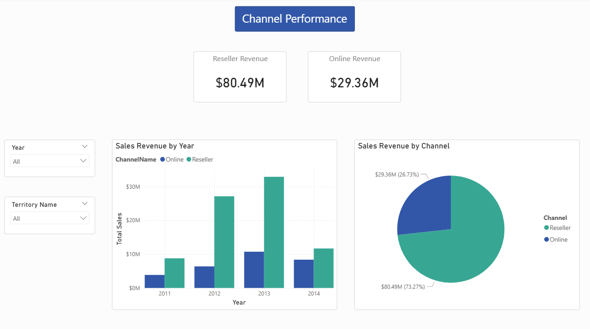

# AdventureWorks Sales BI Project

An end-to-end BI portfolio project built on the AdventureWorks database using SQL Server, SSIS, and Power BI.

## Overview

AdventureWorks management needs a better sales reporting solution. The source database is a transactional OLTP system — not suited for analytics. This project builds a complete BI pipeline from source exploration through to an interactive Power BI dashboard.

## Architecture

AdventureWorks (OLTP)
        │
        ▼  Extract raw data
AdventureWorks_Staging  ──►  data quality checks & cleaning
        │
        ▼  Transform & Load
AdventureWorksDW (Star Schema)
        │
        ▼
Power BI Dashboard

| Layer | Database | Purpose |
|---|---|---|
| Source | `AdventureWorks` | Production OLTP — read only |
| Staging | `AdventureWorks_Staging` | Raw copy of source; used for quality checks and cleaning |
| Warehouse | `AdventureWorksDW` | Star schema optimised for analytics and reporting |

## What Was Built

### Star Schema
Five dimensions and one fact table:

| Table | Rows | Description |
|---|---|---|
| `FactSales` | 121,317 | Grain: one row per sales order line |
| `DimDate` | 2005–2030 | Pre-generated date dimension |
| `DimProduct` | 295 | Products with at least one sale |
| `DimCustomer` | 19,820 | Individual and store customers |
| `DimTerritory` | 10 | Sales territories with country and group |
| `DimChannel` | 2 | Online vs Reseller |

### ETL (SSIS)
- Separate packages per staging table — parallel-safe load design
- Staging-to-warehouse packages handle type casting, surrogate key lookups, and NULL handling
- Master package (`Master.dtsx`) orchestrates the full load sequence
- S2 cleaning packages redirect invalid rows to per-entity error tables (`stg_Product_Error`, etc.) and log run summaries to `stg_ETL_log`
- S3 warehouse load packages route surrogate key lookup failures to a single shared `stg_errors_Lookup` table

### Reporting Views & Procedures
Reusable SQL objects built on top of the warehouse for ad-hoc analysis and scheduled reporting.

### Power BI Dashboard (5 pages)
1. **Sales Performance** — monthly trend, total sales, total orders, average order value
2. **Product & Category Analysis** — revenue by category/subcategory, top products by revenue vs volume
3. **Customer & Territory Insights** — top customers, territory performance, channel split
4. **Seasonal & YoY** — year-over-year comparisons, seasonal peaks, sales growth %
5. **Channel Performance** — Online vs Reseller revenue breakdown

| Page 1 | Page 2 |
|---|---|
|  |  |

| Page 3 | Page 4 |
|---|---|
|  |  |

| Page 5 |
|---|
|  |

## Validation Summary

All checks passed. Key results:

- `FactSales` row count: **121,317** — exact match with source `SalesOrderDetail`
- FK integrity: **0 orphaned rows** across all 5 dimension keys
- Total revenue variance: **$267.50 (0.0002%)** — floating-point rounding only
- Performance: all warehouse queries completed in **< 500 ms**

See [validation-report.md](src/docs/validation-report.md) for full details.

## Repository Structure

src/
├── docs/               project notes and design decisions
├── sql/
│   ├── 00_analysis/    source profiling and data quality checks
│   ├── 01_warmup/      SQL warm-up query pack
│   ├── 02_reporting_queries/   business KPI queries
│   ├── 03_views_procedures/    reusable views and stored procedures
│   ├── 04_staging/     staging database and table definitions
│   └── 05_warehouse/   warehouse schema and dimension/fact scripts
├── ssis/               SSIS ETL project and validation scripts
├── powerbi/            DAX measures, report design notes, screenshots
└── diagrams/           star schema and architecture diagrams
github-issues/          issue templates used to track each phase of work

## Key Documents

- [Project Scope](src/docs/project-scope.md) — business scenario, objectives, and phases
- [Source Analysis](src/docs/source-analysis.md) — AdventureWorks table inventory and join map
- [Warehouse Design](src/docs/warehouse-design.md) — star schema design and source-to-target mapping
- [ETL Design](src/docs/etl-design.md) — ETL flow, load strategy, and error handling
- [Reporting Notes](src/docs/reporting-notes.md) — Power BI page design and KPI decisions
- [Validation Report](src/docs/validation-report.md) — row count, FK integrity, and revenue checks
- [DAX Measures](src/powerbi/measures.md) — all Power BI measures with business meaning

## Technologies Used

| Tool | Purpose |
|---|---|
| SQL Server 2019+ | Source, staging, and warehouse databases |
| SSMS / VS Code (mssql) | Query development and schema exploration |
| SSIS (Visual Studio) | ETL pipeline |
| Power BI Desktop | Dashboard and report authoring |
| Git / GitHub | Version control and issue tracking |

## Lessons Learned

- Staging layer pays off — having a clean intermediate layer made debugging ETL issues much easier than loading directly to the warehouse
- Surrogate key lookups in SSIS require the dimension to be loaded first; load order matters
- DimDate should be pre-loaded via script before any ETL runs — not populated by SSIS
- Products with no sales history are intentionally excluded from `DimProduct` to keep the model focused on actuals
- Power BI relationships work correctly only when surrogate keys (not business keys) are used as join columns
